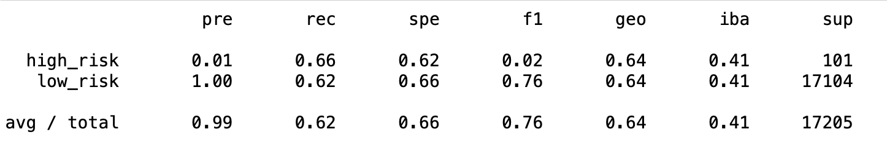
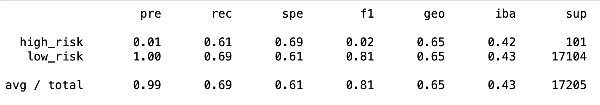
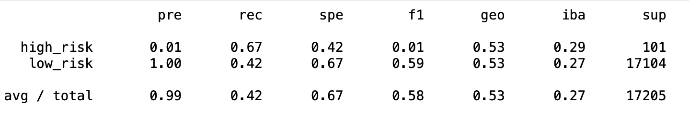
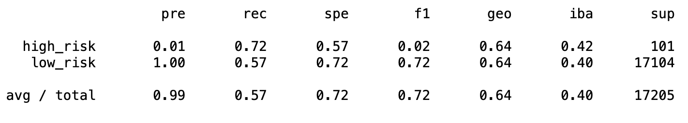
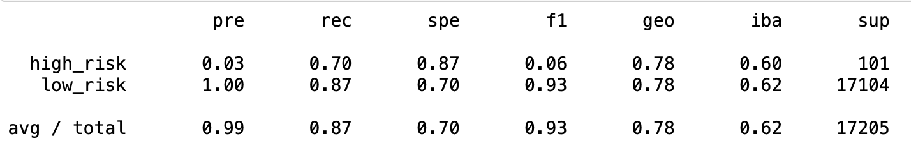
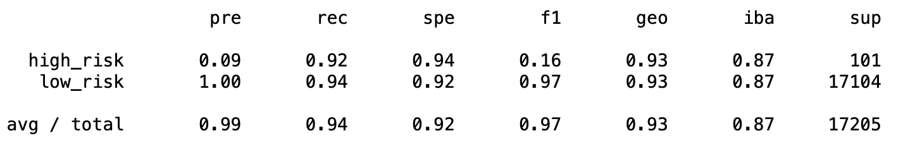

# Credit_Risk_Analysis
## Overview of the analysis
The purpose of this analysis is to analyze how well six different machine learning models predict credit card risk. The six different machine learning models are RandomOverSampler, SMOTE, ClusterCentroids, SMOTEENN, BalancedRandomForestClassifier, and EasyEnsembleClassifier.

## Results
- Precision (Proportion of positive identifications was actually correct)
- Recall (Proportion of actual positives was identified correctly)

### RandomOverSampler

##### high_risk
- high_risk performace is very low f1 (0.02)
- high_risk precision is very low (0.01)
- high_risk recall is higher than precision but not very accurate (0.66)

##### low_risk
- low_risk performace is good f1 (0.76)
- low_risk precision performed perfectly (1.0)
- low_risk recall was not very accurate (0.62)

### SMOTE

##### high_risk
- high_risk performace is very low f1 (0.02)
- high_risk precision is very low (0.01)
- high_risk recall is higher than precision but not very accurate (0.61)

##### low_risk
- low_risk performace is good f1 (0.81)
- low_risk precision performed perfectly (1.0)
- low_risk recall is good (0.69)

### ClusterCentroids

##### high_risk
- high_risk performace is very low f1 (0.01)
- high_risk precision is very low (0.01)
- high_risk recall is well (0.67)

##### low_risk
- low_risk performace is not good f1 (0.59)
- low_risk precision performed perfectly (1.0)
- low_risk recall is not good (0.42)

### SMOTEENN

##### high_risk
- high_risk performace is very low f1 (0.02)
- high_risk precision is very low (0.01)
- high_risk recall is good (0.72)

##### low_risk
- low_risk performace is good f1 (0.72)
- low_risk precision performed perfectly (1.0)
- low_risk recall is good (0.57)

### BalancedRandomForestClassifier

##### high_risk
- high_risk performace is very low f1 (0.06)
- high_risk precision is very low (0.03)
- high_risk recall is good (0.70)

##### low_risk
- low_risk performace is good f1 (0.93)
- low_risk precision performed perfectly (1.0)
- low_risk recall is good (0.87)

### EasyEnsembleClassifier

##### high_risk
- high_risk performace is very low f1 (0.16)
- high_risk precision is very low (0.09)
- high_risk recall is good (0.92)

##### low_risk
- low_risk performace is good f1 (0.97)
- low_risk precision performed perfectly (1.0)
- low_risk recall is good (0.94)

## Summary
Summary: Summarize the results of the machine learning models, and include a recommendation on the model to use, if any. If you do not recommend any of the models, justify your reasoning.
